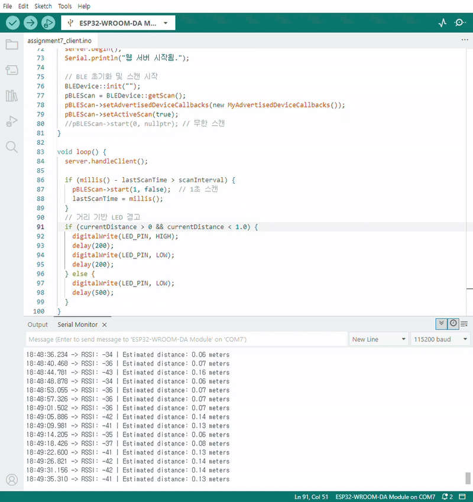

# IoT25-HW07-ESP32-BLE-based-Distance-Estimation-System

## Screenshots of working project


## Excuting photo and video




## Source code
### Sever code
```cpp
#include <BLEDevice.h>
#include <BLEUtils.h>
#include <BLEServer.h>

void setup() {
  Serial.begin(115200);
  BLEDevice::init("ESP32_team12");  // 서버 이름

  BLEServer *pServer = BLEDevice::createServer();
  BLEAdvertising *pAdvertising = BLEDevice::getAdvertising();

  pAdvertising->setScanResponse(false);
  pAdvertising->setMinPreferred(0x06);
  pAdvertising->setMinPreferred(0x12);
  BLEDevice::startAdvertising();
  Serial.println("BLE 서버 광고 시작됨");
}

void loop() {
  delay(2000);
}
```

### Client code
```cpp
#include <WiFi.h>
#include <WebServer.h>
#include <BLEDevice.h>
#include <BLEScan.h>
#include <BLEAdvertisedDevice.h>

#define LED_PIN 2

// Wi-Fi 정보 입력
const char* ssid = "";
const char* password = "";

// 거리 계산 변수
int txPower = -65;  // 1m 거리에서의 RSSI
float n = 2;
float currentDistance = 0.0;

WebServer server(80);  // 웹 서버 포트

BLEScan* pBLEScan;  // 전역 변수로 선언
unsigned long lastScanTime = 0;
const unsigned long scanInterval = 3000; // 3초 간격으로 스캔


float calculateDistance(int rssi) {
  return pow(10.0, ((txPower - rssi) / (10.0 * n)));
}

class MyAdvertisedDeviceCallbacks : public BLEAdvertisedDeviceCallbacks {
  void onResult(BLEAdvertisedDevice advertisedDevice) {
    if (advertisedDevice.getName() == "ESP32_team12") {
      int rssi = advertisedDevice.getRSSI();
      currentDistance = calculateDistance(rssi);

      Serial.print("RSSI: ");
      Serial.print(rssi);
      Serial.print(" | Estimated distance: ");
      Serial.print(currentDistance);
      Serial.println(" meters");
    }
  }
};

// 웹 페이지 핸들러
void handleRoot() {
  String html = "<!DOCTYPE html><html><head><meta charset='utf-8'><meta http-equiv='refresh' content='2'>";
  html += "<title>ESP32 BLE 거리 측정</title></head><body>";
  html += "<h1>실시간 거리 측정</h1>";
  html += "<p>거리: ";
  html += String(currentDistance, 2);
  html += " meters</p>";
  html += "</body></html>";
  server.send(200, "text/html", html);
}

void setup() {
  Serial.begin(115200);
  pinMode(LED_PIN, OUTPUT);

  // Wi-Fi 연결
  WiFi.mode(WIFI_STA);
  WiFi.begin(ssid, password);
  Serial.print("WiFi 연결 중");
  while (WiFi.status() != WL_CONNECTED) {
    delay(500);
    Serial.print(".");
  }
  Serial.println("\nWiFi 연결됨. IP 주소: " + WiFi.localIP().toString());

  // 웹 서버 시작
  server.on("/", handleRoot);
  server.begin();
  Serial.println("웹 서버 시작됨.");

  // BLE 초기화 및 스캔 시작
  BLEDevice::init("");
  pBLEScan = BLEDevice::getScan();
  pBLEScan->setAdvertisedDeviceCallbacks(new MyAdvertisedDeviceCallbacks());
  pBLEScan->setActiveScan(true);
  //pBLEScan->start(0, nullptr); // 무한 스캔
}

void loop() {
  server.handleClient();

  if (millis() - lastScanTime > scanInterval) {
    pBLEScan->start(1, false);  // 1초 스캔
    lastScanTime = millis();
  }
  // 거리 기반 LED 경고
  if (currentDistance > 0 && currentDistance < 1.0) {
    digitalWrite(LED_PIN, HIGH);
    delay(200);
    digitalWrite(LED_PIN, LOW);
    delay(200);
  } else {
    digitalWrite(LED_PIN, LOW);
    delay(500);
  }
}
```
